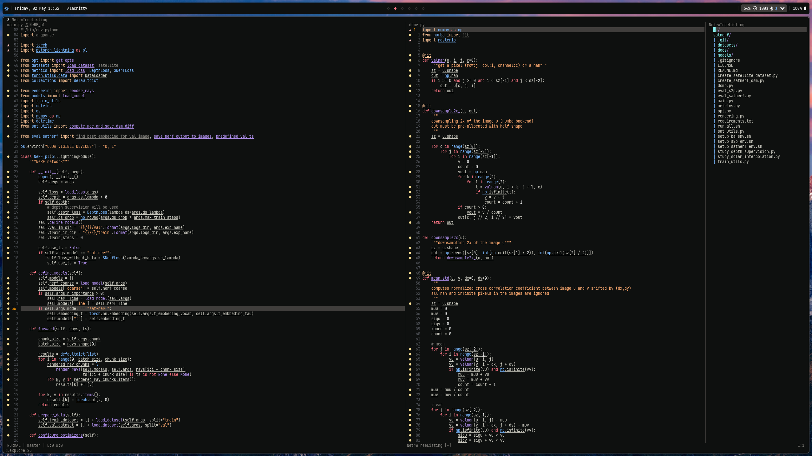

## Cisco-theme.nvim 
[](https://github.com/rdrachmanto/cisco-theme.nvim/blob/main/LICENSE) [](https://github.com/rdrachmanto/cisco-theme.nvim/stargazers)

> [!WARNING]
> This theme is still currently in development!



This is a port of Cisco theme, originally for Zed editor, now available for Neovim. 

## Installing

1. Install with your choice of package manager, below is an example using `lazy.nvim`

   ```lua
   {
      "rdrachmanto/cisco-theme.nvim",
       config = function()
           require("cisco").setup({
               contrast = {
                   floating_windows = true
               }
           })
       end
   }
   ```

2. Put this inside your init.lua:

   ```lua
   vim.cmd("colorscheme lua")
   ```

## Supported Plugins

WIP!

## Options

This theme can be tweaked, the default options are as follows:

```lua
require("cisco").setup({
    contrast = {
        floating_windows = true  -- Options: true or false, if true, use lighter background color for floating windows (Lazy, WhicKey, etc..)
    }
})
```

## Credits

This port is based on [Zed cisco theme](https://github.com/thommorais/zed-cisco-theme) by [Thom morais](https://github.com/thommorais)
